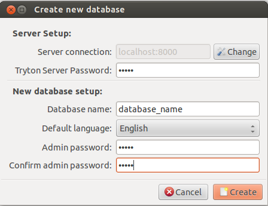
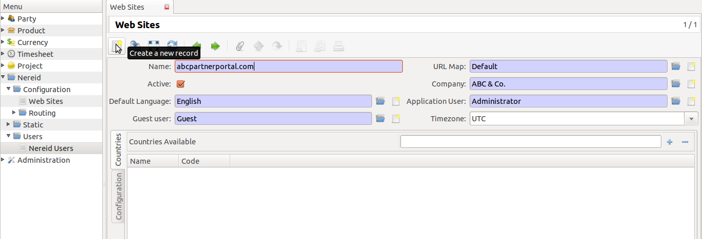
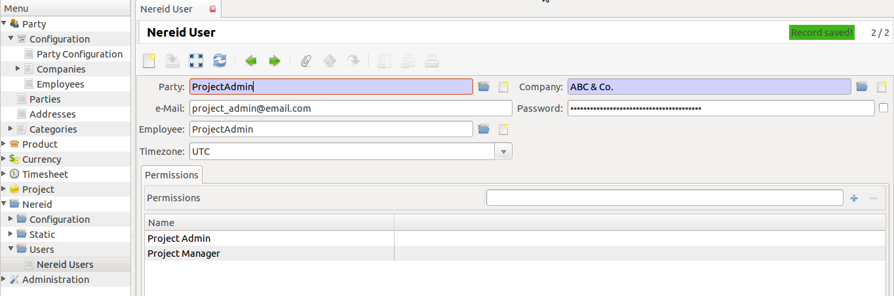
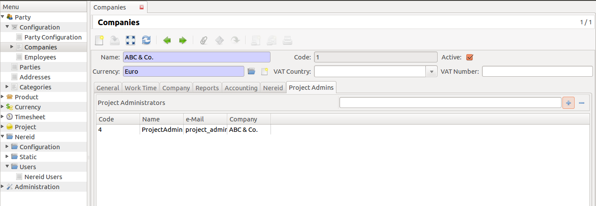
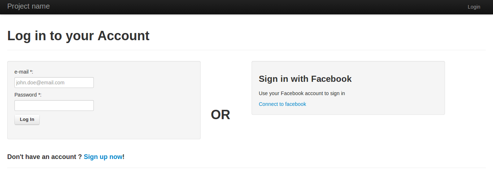

.. _quickstart:

Getting Started
===============

Eager to get started? This page gives a good introduction to Nereid Project.
It assumes you already have Nereid and Nereid Project installed. If you do not, 
head over to then :ref:`installation` section.

A minimal application
---------------------

A minimal Nereid application first requries a Tryton database with the
Nereid module installed. If you already have a database with Nereid
installed head over to `creating website`_.

Setting up a database
`````````````````````

To create a new Tryton database, you will need to fill out the information as on 
the screenshot:

* Server connection     :  localhost:8000
* Tryton Server Password:  admin
* Database name         :  database_name
* Admin password        :  admin



This is how you can create a new database. Now to login your ERP using the 
Tryton client, you need the following information: 
   
* Host     : localhost:8000
* Database : database_name
* User name: 'admin' or Ask your administrator for this information.
* Password : 'admin' or Ask your administrator for this information.

.. _creating website:

Creating a new website
``````````````````````

Once the nereid module is installed in a Tryton database, open the `Websites` 
menu under `Nereid/Configuration`, and create a new website with the following 
settings.

    +-----------+-------------------------------+
    | **Field** | **Value**                     |
    +-----------+-------------------------------+
    | Name      | abcpartnerportal.com          |
    +-----------+-------------------------------+
    | URL Map   | Choose `Default`              |
    +-----------+-------------------------------+
    | Company   | Choose your Company           |
    +-----------+-------------------------------+
    | Default   | English                       |
    | Language  |                               |
    +-----------+-------------------------------+
    | Guest User| Create a new Nereid User      |
    +-----------+-------------------------------+
    | App User  | Create or choose a User       |
    +-----------+-------------------------------+

The default language is the language your website is displayed in. When a user 
visits the root of the website (say example.com), the user will be redirected to 
abcpartnerportal.com/default_language/

Example: If English US is selected as Default Language, then the user will be
redirected to ``abcpartnerportal.com/en_US/``

This is the tryton user with which the application will run. Ensure that the 
user you choose has the sufficient permissions (through groups) to access and 
update tryton models related to project management.



When the web site is created. It is recommended to create a new Nereid User. 
Here in above screenshot a new nereid user as a guest is created. But for
giving privileges to the project, you need to create other nereid users also,
they can be employee of your company, the clients, the stakeholders, etc.

.. _admin:

Admin Users
------------

After creating website as mentioned in `creating website`_, create a new
admin user as shown below:


   
Now we need to set up the created nereid user as project admin, because only 
project admins are able to create, maintain, the project. And there should
be one project admin at least, it entirely depends upon you, how many project 
admins does anybody wants for a project. For that goto company's module, and 
for that company add the nereid user in ``Project Admins`` tab.
 


Refer to the :py:class:`trytond_nereid.routing.WebSite` for details on what 
each of the fields mean.

.. tip::
    Since version 2.0.0.3 the name of the website is used by the WSGI
    dispatcher to identify the website that needs to be served. When you
    test the site locally, it is not usually possible to mimic your
    production url. This can be overcome by using a simple WSGI middleware
    which overwrite HTTP_HOST in the environ.

.. _launching_application:

Launching the application and template
```````````````````````````````````````

Once the website is created, a python script which loads nereid and runs
the application needs to be written. This script is used to load Nereid,
configure your application settings and also serves as an APP_MODULE if
you plan to use WSGI HTTP servers like `Gunicorn`_

.. note::
   DATABASE_NAME has to be changed in ``application.py``. Mention the
   database name you have created while setting the database in tryton client,
   and also the site name which you mentioned while creating the website.

.. code-block:: python

    #!/usr/bin/env python
    from nereid import Nereid

    CONFIG = dict(

        # The name of database
        DATABASE_NAME = 'database_name',

        # Static file root. The root location of the static files. The static/ will
        # point to this location. It is recommended to use the web server to serve
        # static content
        STATIC_FILEROOT = 'static/',

        # Tryton Config file path
        TRYTON_CONFIG = '../etc/trytond.conf',

        # If the application is to be configured in the debug mode
        DEBUG = False,

        # Load the template from FileSystem in the path below instead of the 
        # default Tryton loader where templates are loaded from Database
        TEMPLATE_LOADER_CLASS = 'nereid.templating.FileSystemLoader',
        TEMPLATE_SEARCH_PATH = '.',
    )

    # Create a new application
    app = Nereid()

    # Update the configuration with the above config values
    app.config.update(CONFIG)

    # Initialise the app, connect to cache and backend
    app.initialise()


    class NereidHostChangeMiddleware(object):
        """
        A middleware which alters the HTTP_HOST so that you can test
        the site locally. This middleware replaces the HTTP_HOST with
        the value you prove to the :attr: site

        :param app: The application for which the middleware needs to work
        :param site: The value which should replace HTTP_HOST WSGI Environ
        """
        def __init__(self, app, site):
            self.app = app
            self.site = site

        def __call__(self, environ, start_response):
            environ['HTTP_HOST'] = self.site
            return self.app(environ, start_response)


    if __name__ == '__main__':
        # The name of the website
        site = 'abcpartnerportal.com'

        app.wsgi_app = NereidHostChangeMiddleware(app.wsgi_app, site)
        app.debug = True
        app.static_folder = '%s/static' % site
        app.run('0.0.0.0') 

You can now test run the application

.. code-block:: sh

    $ python application.py

The above command launches a single threaded HTTP Server for debugging
purposes which listens to the port 5000. Point your browser to
`localhost:5000 <http://localhost:5000/>`_ 



Now the installation is successful. Refer :ref:`tutorial`. 

.. _Gunicorn: http://gunicorn.org/
