.. _tutorial:
   
Nereid Project Tutorial
=======================

This tutorial gives an overview into how nereid project is organized and how it 
works with the Tryton project module. Familiarity with the tryton project module 
is not assumed, but could make the project easier to understand. Follow
:ref:`quickstart` before starting this tutorial.

Creating Your First Project
----------------------------

Everything within the Project Management system starts out with a project.
Projects start out with a simple default process, with two phases/states:
opened, and done. Tasks, Tickets, Attachments, all must belong to a project. So
let's get started with creating a project... 

When logged in as a project admin, see :ref:`admin`, he can create new projects,
invite new or existing users to the project and change settings related to the
project. Now when project is created, the whole features regarding that project
are visible.

* Click the New Project button (found at the top right of every Project
  Management Page)

* A modal window will then slide into view, where you will find fields for
  entering the title of the project. Once you are done, click Save.

* You will now be taken to the Project overview screen, you just created your
  first project!
  
See the screenshot shown below: 

.. _project management screen:

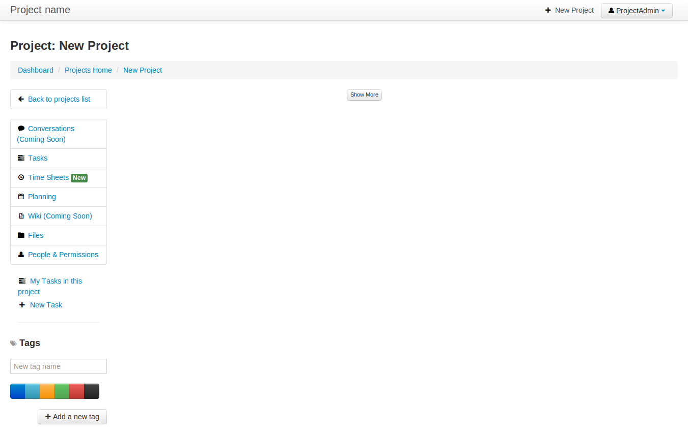

Projects are assigned and related to clients, project managers and the
appropriate employees. Each can have separate log-ins that allow them to view
their specific projects.   

.. note::
    Only the project admin <:ref:`admin`> can create the project on Project
    Management System.

Creating project on tryton client
---------------------------------

Alternatively projects could be created from your preferred Tryton client as
shown below:
 
1. Click the Create New button (found at the top left of every form view in
   tryton)

2. Where you will find fields for entering the title of the project, the type
   (whether project or a task), Company, participants or assignee (if any),
   State of the project(opened or done).

3. Once you are done, click on Save button found at top left of the form view,
   next to New button.

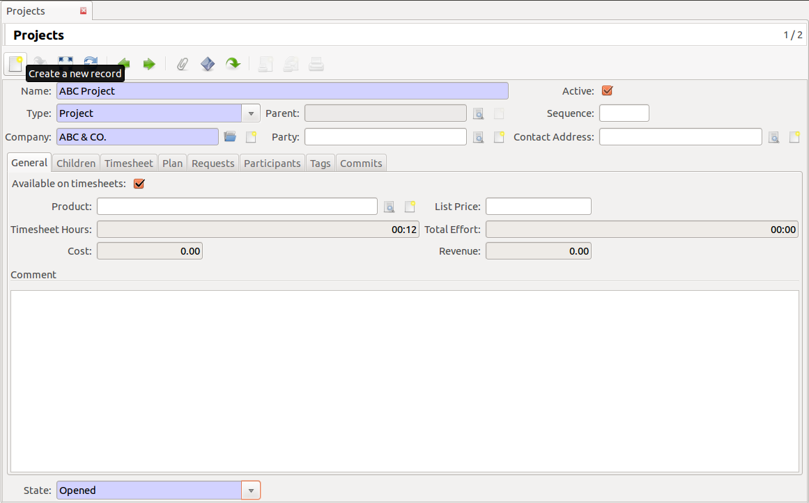

Project admin adds the project, or performs any changes through tryton client,
it gets updated to web-interface, and vice-versa.

Adding Participants to Project via tryton client
------------------------------------------------

The project permissions allow project admin to control exactly what he wants
his employees to be able to access. The participants to the project can only be
added by the project admin through tryton client as shown below in the
screenshot, participants are then allowed to do list of following things - can 
view project, contributes to the project, create tasks, updates the progress
made so far, change the state of the task, assign it to other participant of
that project, mark their contribution time, etc.

This below figure shows how to add the project participants on tryton client:

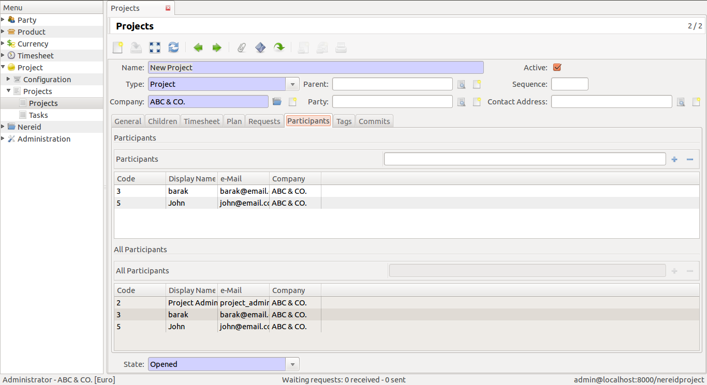

Changing State:
```````````````

To change the status of a project, simply change the drop down value located to
the down-left side. It signifies the state of the project whether it is done or
opened.

.. note:: State can be changed only by project admin

.. _invitation:

Invite others and manage your team via web interface
----------------------------------------------------

With the multi-user log-ins project admin can control who has access to Project.
Company's clients, staff, vendors, will all be kept up to date on the projects
they are assigned to.
Nereid Project makes it easy to invite others to collaborate on project, and
lets project admin organize team members for project. For example, project
admin let certain users view specific project but not other project. 

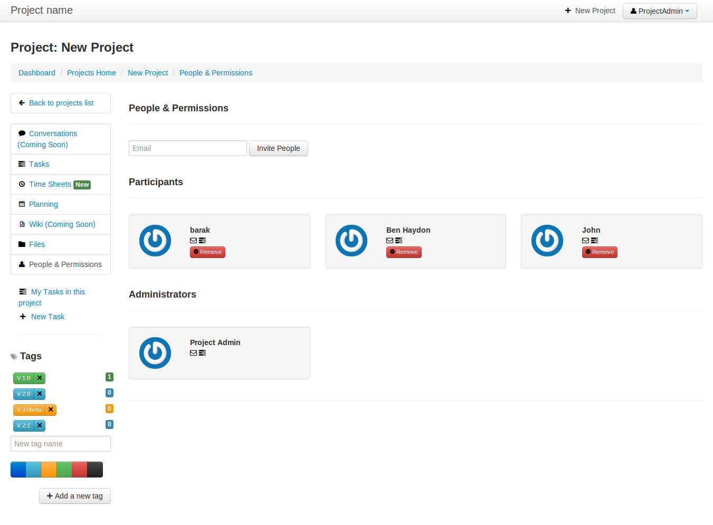

The Project Management Screen
-----------------------------

The screenshot shown above, `project management screen`_, is the main page
where you'll spend most of you time - the project management screen - the page
that let's you view everything relating to your project, everything is on a
single page, at your finger tips, right where you need it. It's extremely
useful for getting things done and quick. 

So at the very top we have the project title, next we have the following
features:

* **Dashboard:** Where a list of of all projects are shown depending upon the
  permissions granted to that nereid user. For more information, see
  `dashboard`_.

* **Projects Home:** This contains all the project details - project team
  member it's assigned to, associated client, total time worked and tasks
  related to projects.
  
* **Tasks:** Every single project can have multiple tasks assigned to it.
  participant of the project can create tasks depending on the requirements to
  achieve the goal of the project as soon as possible. See `tasks`_.

* **Time Sheets:** The timesheet module allow to track the time spent by
  employees on various tasks. This module also comes with several reports that
  show the time spent by employees. For more refer `timesheet`_.

* **Planning:** This uses the feature of gantt charts and gantt Charts visually
  get the big picture or where you are with regards to all of your ongoing
  tasks. The Nereid Project has a wonderful interface that is completely
  intuitive.Refer `planning`_.

* **Files:** Attach and display project related documents in Nereid Project. It
  is possible to attach files to projects or tasks. Attach and share files in
  the right context. One can attach many number of files to the task. Later
  these files can be downloaded/browsed. See more in `files`_.

* **People and Permissions:** The participants of the project, comes under
  this, project admin can invite, remove participants from the project from
  here. See `invitation`_.

.. _tag:

* **Tags :** User can also apply tags to tasks within the project management
  system. As with colors, the meaning of tags is up to user — user might use
  them to indicate priority, features, category, or any other information to
  keep them organized into groups or classes of work they find useful. Just
  select the color, and add title or name along with it.
  
* **Estimated Effort** : The estimated effort for a task. See
  `estimated effort`_.

..and much more.

.. _tasks:

Creating Task
--------------

The ability to define a task, assign it to someone, create a deadline, and know
when it's complete — is generally the most desired and ubiquitous feature in
project-management system.

Once a project is created, tasks are assigned to participants who are solely
responsible for that task. Nereid Project streamlines the process of adding and
assigning tasks.

While creating task, one can do following things:

* Due dates on tasks

* Start dates on tasks

* Add estimated completion time to each task

* Assign tasks to participants.

* Attach files and comments to a task.

* Notify people about a task.

Though any participant can create tasks, in the figure shown below, the project
admin is creating the task,  with the title and description related to that
task, can assign it to any of the participants, team members of that project in
seconds, can put estimated efforts, start and end date for the task. Project
participant can also assign it to other participant of the project.

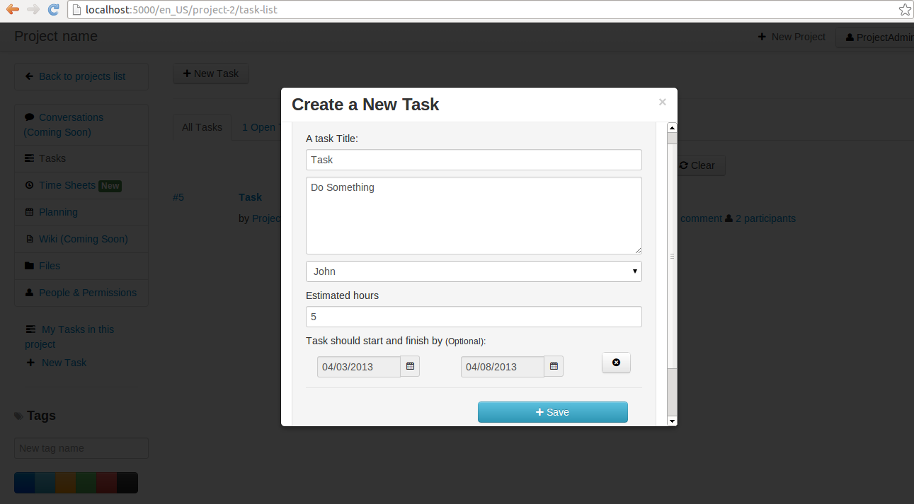

.. note::
   Any nereid user having access to project can create task, update the task by
   putting comments, upload files into it, and assign it to other nereid user
   of that project. See `update`_.

.. _reST primer:

Basic RST primer
----------------

This section is a brief introduction to reStructuredText (reST) concepts and
syntax, reST was designed to be a simple, unobtrusive markup language. For more
refer `RST primer <http://sphinx-doc.org/rest.html>`_

Lists
`````
Just place an asterisk at the start of a paragraph and indent properly. The
same goes for numbered lists;they can also be autonumbered using a ``#`` sign::
  
  * This is a bulleted list.
  * It has two items, the second
  item uses two lines.

   1. This is a numbered list.
   2. It has two items too.

   #. This is a numbered list.
   #. It has two items too.

Paragraph
`````````
As in Python, indentation is significant in reST, so all lines of the same
paragraph must be left-aligned to the same level of indentation.

Inline markup
`````````````
The standard reST inline markup is quite simple: use

* one asterisk: ``*text*`` for emphasis (italics),
* two asterisks: ``**text**`` for strong emphasis (boldface), and
* backquotes: ````text```` for code samples.

Code Highlighting
``````````````````
The highlighting language can be changed using the ``highlight`` directive, by
default, this is ``'python'`` as the majority of files will have to highlight
Python snippets used as follows::

     .. highlight:: c

An example in python code highlighting::

    .. code-block:: python

       def some_function():
           interesting = False
           print 'This is '
           print 'code highlighting'
           print '...'

.. _update:

Updating task
--------------

Task updates can be formatted using `reST primer`_ syntax for
making comments or updates looks clear. For more `reST(restructured Text)
<http://docutils.sourceforge.net/docs/ref/rst/directives.html>`_

Updates can be written to clarify progress made so far for the task, for
changing the state of the task, for marking time i.e., the time spent by the
employee on that task etc. While marking time user can also update the `state`_


.. image:: images/task.png
   :width: 800
   :align: center

.. _timesheet:

Marking Time
`````````````

Nereid Project enables the team to record their time directly on their tasks on
every update. Each time the employee comments on a task, the time entered is
updated along with it. 

For marking time, see below: 

.. tip::
   User will need to understand how much time they are devoting to each task
   and mark time in hours. For marking time in minutes, convert those minutes
   to hours, like, for entering 6 minutes - mark '.1', for 30 minutes - mark
   '.5' and so on.

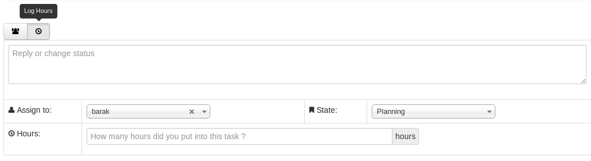

View my-tasks
-------------

Project participants can see their task list, and these lists easily help user
to keep track of every assigned tasks on a project, quickly tells the `state`_,
and with `tag`_ (if associated to it)!

.. admonition:: And, by the way...

   Drag and Drop- To change the state of the task, just drag and drop task from
   one state to the necessary state. 

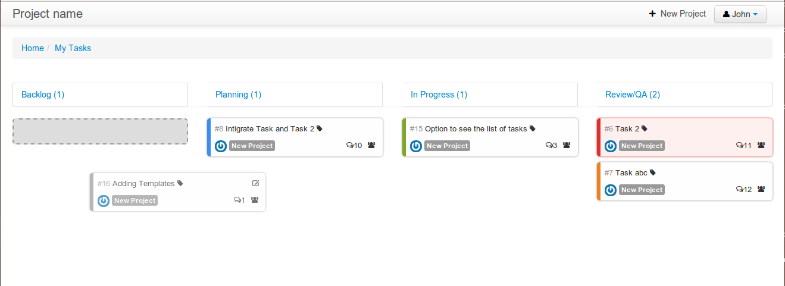

View all tasks
```````````````

The employees who get access see all tasks gathered in this project as user
might want to see all of the tasks quickly, find a task when don’t remember its
name. It can be really helpful to get a comprehensive view of all the tasks.  

* Striped multi-colour tasks in NereidProject- tasks with different colors
  signifies different `state`_
* Make an instant search of a task
* All tasks together, so user can go to one place for all the history of the
  work.

To see All Tasks, Open Tasks, Done Tasks just click on the ``Tasks``
Button shown on the left, for reference see below:

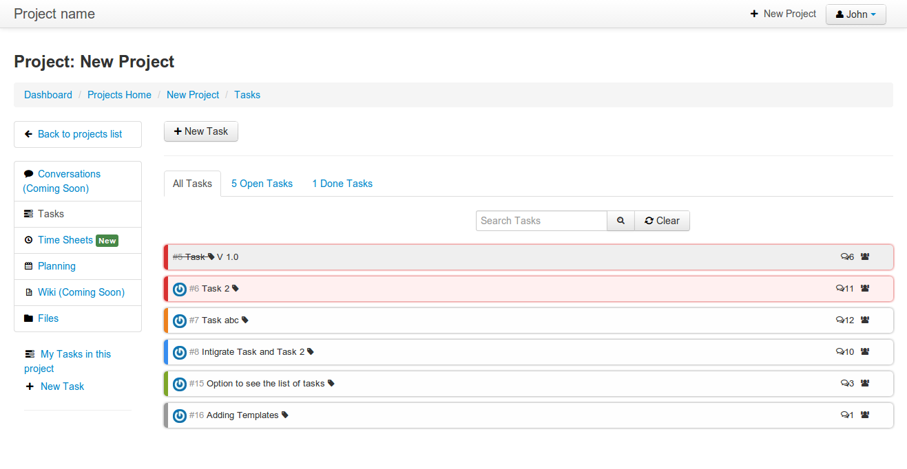

.. _state:

State of Task
-------------


Ideal way the project admin and participants are using to manage their tasks
is to specify the state while updating or assigning along with it. This can be
considered as the tasks progress. For greater transparency of task these
following states are defined:
 
* **Backlog:** The task's backlog state is a state containing short
  descriptions of all functionality desired in the task when assigned to
  participant. The task backlog state can consists of features, bug fixes,
  non-functional requirements, etc. - whatever needs to be done in order to
  deliver it successfully. The default state of task is backlog after being
  created.
* **Planning:** The backlog state can then move into planning, this determines
  how much of it the user can commit to complete the task.
* **In Progress:** Development comes under this state to fulfil the
  requirements that must end on time.
* **Review:** After development state, user can now assign it back to the
  :ref:`admin`, to review. If requirements are not completed, the state
  then be back into ``In Progress`` or ``Planning`` or ``Backlog``.
* **Done:** If requirements met, the task can then be marked as Done.

In their simplest, the tasks are categorized into the work stages:

* from Backlog --> Planning

* from Planning --> In Progress

* from In Progress --> Review/ QA
    
* from Review/QA --> Done

Remove participants from task notification
```````````````````````````````````````````

While updating task user can add or remove people among participants to get
notified or not, by clicking on ``Notify People`` button. This shows the list
of participants of that project. Anytime a task is updated all participants of
the project will get notified by e-mail about the progress of the task and a
link back to the specific Project task. See below, from where to add-remove
participants for the current task:

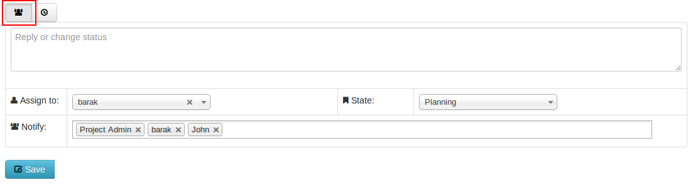

E-mail Notification
-------------------

An integral part to the Nereid Project is email notification. Each project
participant as well as the project admin receives an automated email
notification whenever there is a change is made to the task. The participants
receives notification about new tasks. Project admin receive notification of
task completion as well as other task progress state.

.. estimated effort::

Estimated Effort
`````````````````

Estimated Effort is a dimension of every task. This allows for time-based
completion calculations on every task. As there would be time consumption on
each task action. This creates a more routine environment for team members
allowing them to spend time on a planned way. So that every task has
achievable schedule objectives.
The estimated effort required to complete the task could also be filled in when
creating the task.
 
.. tip::
   To enter the estimated time afterwards creating the task. Click the
   ``Estimated Hours`` button on the left side of the web-interface, a modal
   window will slide into view, where you can enter the time.

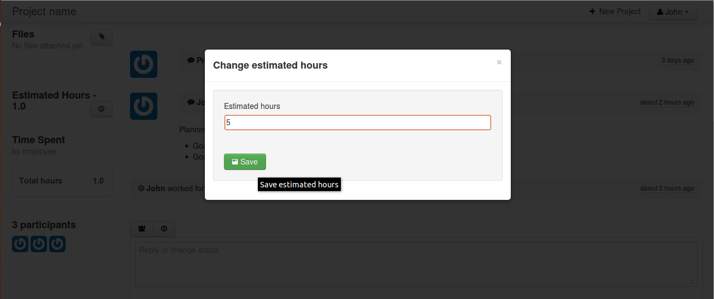

.. _files:
   
Dropbox
--------

User can attach files directly to tasks, to help keep everything organized and
in one place. Once a file is attached, all participants can access it quickly.
The attachment section allows you to upload files to the project or task.

There are two ways for attaching files to Project Management System:

* Link(From Internet): Provide the URL from internet source, it stores the link

* Local(From your Computer): Choose a local file from your system to upload

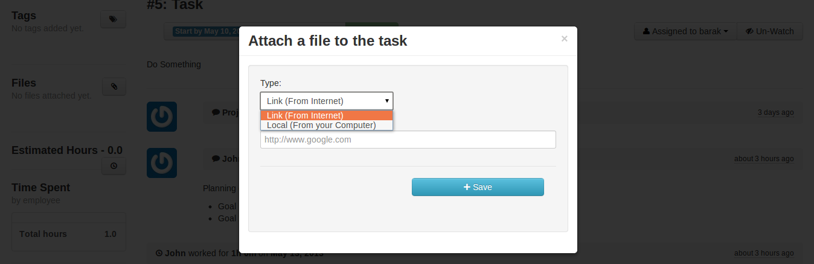

To upload attachments to Nereid Project, follow these steps:

* Open up the task to attach a file, click Files button on the left side for
  attaching files or link, a modal window slide into view and from the
  drop-down menu, select type to attach i.e., to attach a link from the
  internet, or file to upload.

* Select the file/link you'd like to attach. Your file will appear in your task
  as shown in figure below.

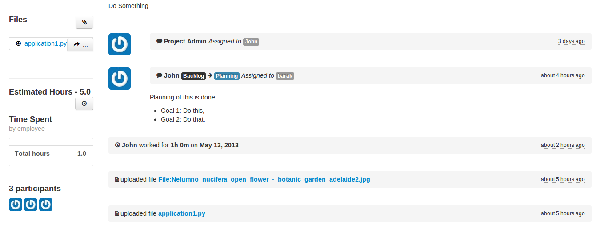

The Files button shows all files that have been attached through individual
posted to the task. Files attached to the system are collected and displayed
here in Files section, along with filename, the description along with it, and
a link to the area where that file is being attached.The original file is
included along with a link to download the file.

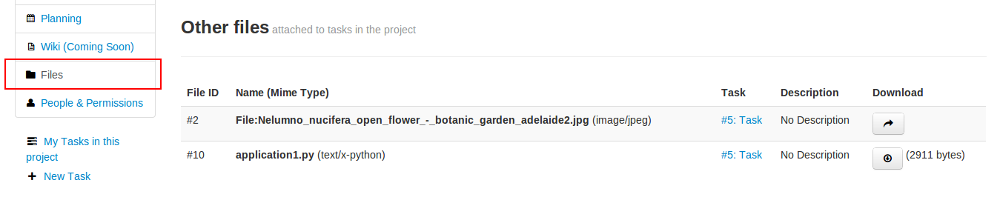

.. _dashboard:

Dashboard
``````````

The project dashboard gives a summary of active projects. Nereid Project's
Dashboard is a customized project information system containing list of
projects, for tracking team progress toward completing an iteration. 

.. tip:: 
   Only those projects are visible to user whose permission is provided by
   project admin.

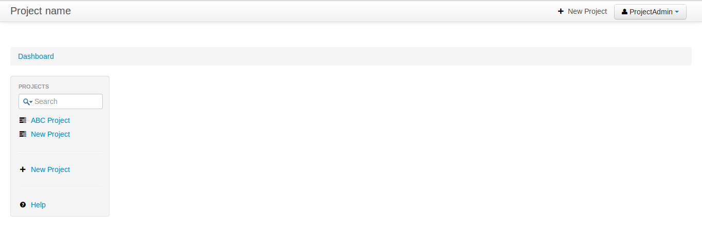
   
Global Timesheet
-----------------

For Project Managers, and Owners - this Timesheet information 'completes the
picture' of project productivity and progress. Team members do not have access
to a global timesheet calendar which details every step within the project
timeline. It helps to delegate and track project tasks and manage the projects
effectively.
This timesheet and online project management application helps to track, or
monitor every hour that is spent on a project, by whom and how they did with
regards to staying within your expected target durations. 

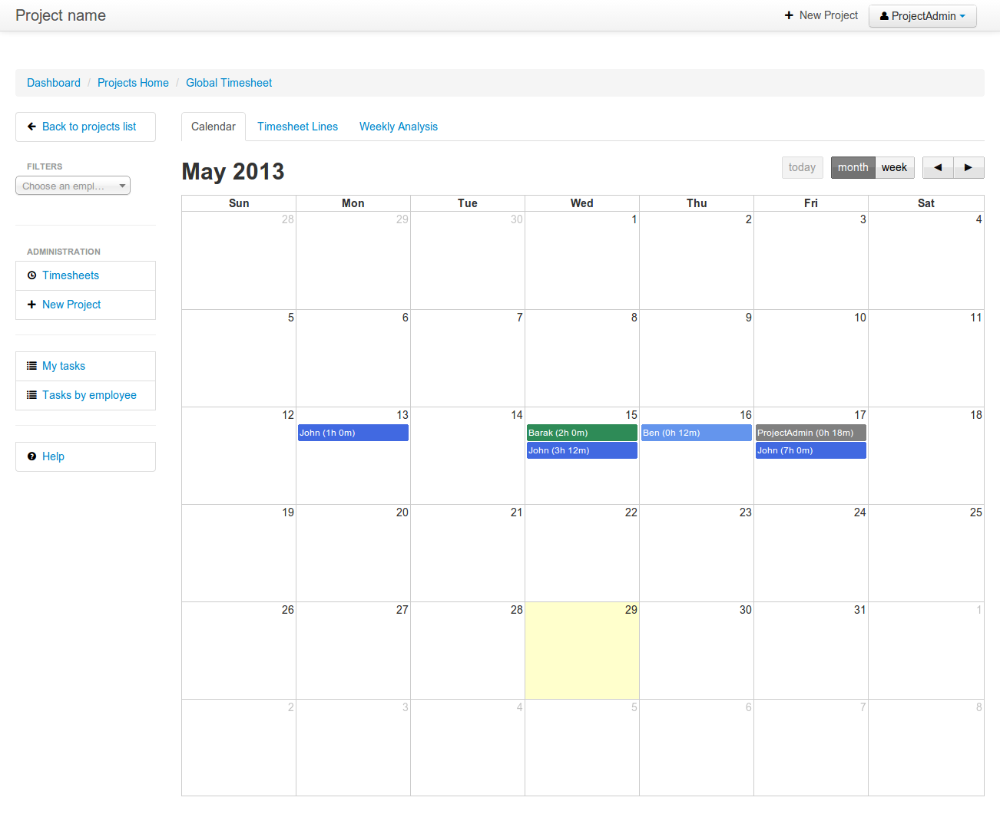

.. tip::
   Project admin can filter the performance by employees also. See top-left
   side of this global timesheet page, there is a search box, enter the name of
   employee to checkout the performance, to track total hours spent by
   individual on that task. Use timesheet to efficiently record the
   “Hours Worked” (per Project, or Task). By using this, project admin can view
   the team's progress and determine whether the team is making sufficient
   progress.

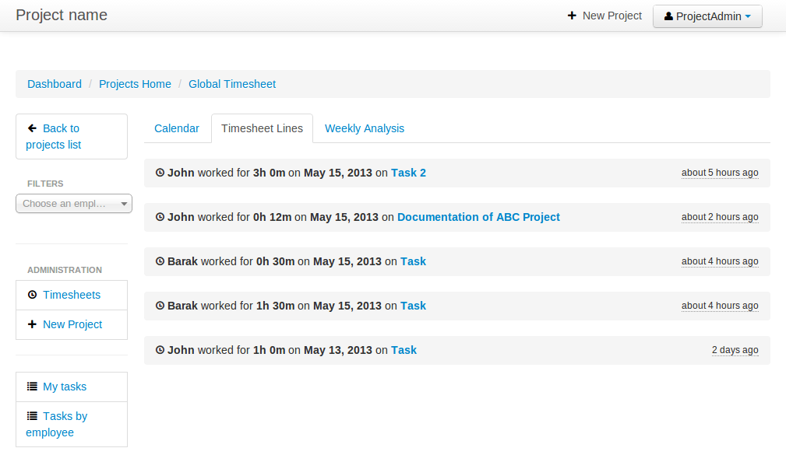

The timesheet line express the fact that one employee spend a part of his/her
time on a specific work at a given date. The list of timesheet lines of
employees associated to the project and its tasks. These timesheet lines are
used to analyse employee's productivity & job costs.

Weekly Analysis
````````````````

To gather data weekly on the actual time spent by employee. For time tracking
to monitor employees performance. The :ref:`admin` can analyse the progress of
the team of the project. Can filter it by employee's name also. Refer image:

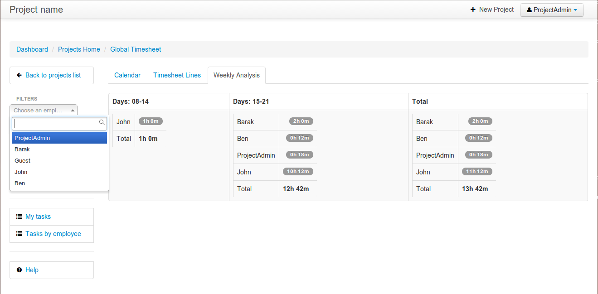

Task by employees
``````````````````

A powerful filter for :ref:`admin` to see tasks holders of the projects.
Shows list of tasks assigned to particular employee.

.. image:: images/tasks-employee.png
   :align: center
   :width: 800

.. _planning:

Calendar 
`````````

The calendar is directly tied to the ongoing projects. The calendar show a
graphical calendar interface with all of the pertinent ongoing tasks. It is
able to filter by month, week or day. Access to calendars and the tasks held
within follow the same access, setup for projects. So that users will only see
the calendar items of the projects they are invited to. For project admin,
calendar provides a number of powerful filters. These filters let project admin
see performance of employees. This is a great feature for project admin to
track your progress on the graphical Gantt charts for their most highly valued
projects.

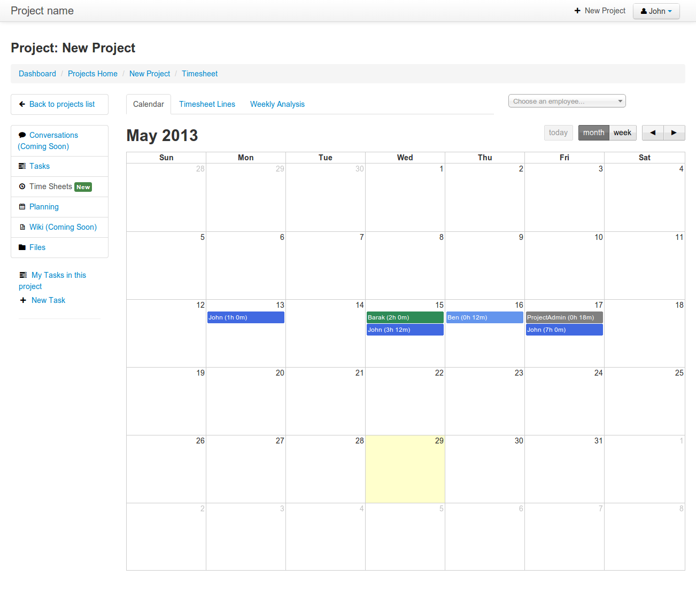
 
Here the logged in user can view the timesheet of his current project, and also
his performance for that project.

.. note:: 
   
   For admin, its easy-to-use, for tracking employee's marked time and
   performance. The row on timesheet lines shows their name, time they worked
   for which task. Shows total time, the employee worked per day.

Project Planning
-----------------

Creating a project plan is the first thing a user should do when taking any kind
of project by putting start and end time on its task. Project planning is a
feature used to reflect the duration of a task within a certain time period. It
is a known fact that a good project plan can make the difference between the
success or failure of a project.

Planning organize, schedule and ensure that tasks get done on time. On short it
can boost productivity. By being better organized and more focused on what have
to be done, and saves time.

This feature is used for projects, but only consist of a list of tasks. To
access it, go to ``Dashboard ‣ Projects Home ‣ New Project ‣ Planning`` ( Here
'New Project' is the name of the selected project ). User can select single
project at a time to see the planning. It shows the Gantt chart for tasks with
start and end time of task or just the duration.


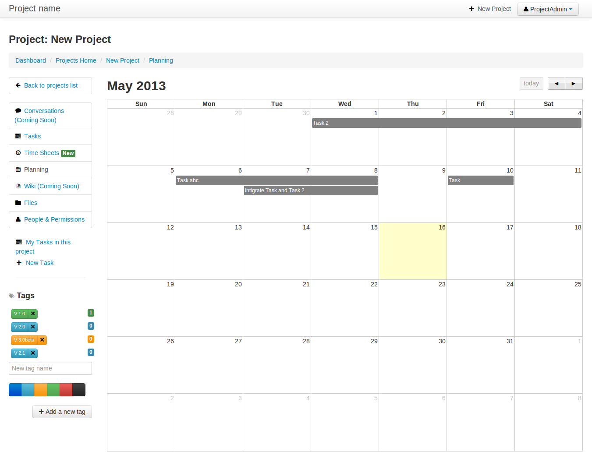
